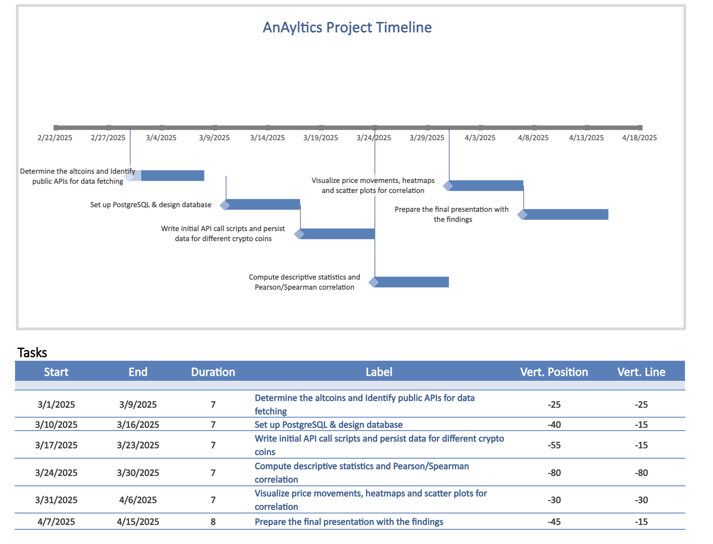

# **Cryptocurrency Market Correlation Analysis**

## **Problem Statement**

### **Cryptocurrency Market Volatility**
Cryptocurrency markets are highly volatile, with prices frequently experiencing large fluctuations within short periods. While Bitcoin (BTC) is the dominant cryptocurrency, accounting for a significant portion of the total market capitalization, its price movements often influence the behavior of altcoins (alternative cryptocurrencies). This phenomenon is particularly evident during bull and bear markets, where Bitcoin's trends can dictate overall market sentiment.

### **Bitcoin's Influence on Altcoins**
Since Bitcoin is widely considered the "reserve currency" of the crypto market, many altcoins exhibit correlated price movements, reacting to BTC’s fluctuations in varying degrees. However, not all altcoins respond uniformly—some may move in tandem with BTC, while others exhibit more independent trends due to unique market factors such as ecosystem development, adoption, and external influences.

### **Importance**
Understanding the correlation between Bitcoin and altcoins is crucial for:
- **Risk Management**: Traders and investors can assess how altcoins move in relation to BTC, enabling them to hedge against market risks.
- **Portfolio Optimization**: Identifying less-correlated assets allows for diversification, reducing exposure to single-asset volatility.
- **Market Sentiment Analysis**: Bitcoin dominance (BTC’s market share relative to altcoins) serves as a key indicator of whether investors favor Bitcoin over altcoins in different market conditions.
- **Strategic Trading Decisions**: High-correlation altcoins can be used for arbitrage strategies, while low-correlation ones can act as alternative investments in volatile periods.

### **Research Question**
This project seeks to answer the question:
**"How do altcoin price movements correlate with Bitcoin’s price movements and dominance in the cryptocurrency market?"**
By analyzing historical price data and computing correlation metrics, we aim to quantify these relationships and understand their implications for traders and investors.

---

## **Data Collection & Description**
- **Source**: Fetching real-time and historical data from Binance, Coinbase, and Kraken APIs.
- **Scope**: At least 5 major altcoins (ETH, BNB, ADA, SOL, XRP) over 1 year.
- **Dataset Structure**:
  - **Timestamps** (15-minute intervals)
  - **OHLC** (Open, High, Low, Close)
  - **Volume**
- **Storage**: PostgreSQL for efficient querying & processing.

---

## **Methodology & Tools**
### **Tools**
- **Python** (Requests, Pandas, NumPy, SciPy)
- **PostgreSQL** (for data storage)
- **Matplotlib/Seaborn** (for visualization)
- **Statsmodels & Scikit-learn** (for correlation analysis)

### **Steps**
1. Fetch & store data in PostgreSQL.
2. Perform data cleaning (handling NaNs, duplicates).
3. Compute correlation coefficients between BTC and altcoins.
4. Visualize trends and patterns.

---

## **Correlation Analysis Approach**
- **Statistical Approach**:
  - **Pearson Correlation**: Measures linear relationship (r-value).
  - **Spearman Rank Correlation**: Captures nonlinear trends.
  - **Rolling Window Correlation**: How correlation changes over time.

---

## **Planned Visualizations**
- **Correlation Heatmap** (to compare multiple altcoins with BTC).
- **Scatter Plots** (visualizing BTC vs. individual altcoins).
- **Rolling Correlation Line Graph** (tracking correlation shifts over time).
- **Histogram of Returns** (to see distribution differences).

---

## **Hypothesis**
- Some altcoins (**ETH, BNB**) will be **highly correlated** with BTC.
- Others (**ADA, SOL**) might be **less correlated** due to independent market drivers.
- **Use Case**: Traders can use these correlations for **hedging strategies** and **diversification**.
- **Limitations**:
  - Market sentiment & news events influence prices unpredictably.
  - External factors like regulations impact correlations.

---

## **Timeline**
| **Week** | **Task** |
|----------|------------------------------------------------|
| **Week 1** | Determine altcoins and identify public APIs for data fetching |
| **Week 2** | Set up PostgreSQL & design the database |
| **Week 3** | Write initial API call scripts and persist data for different crypto coins |
| **Week 4** | Compute descriptive statistics and Pearson/Spearman correlation |
| **Week 5** | Visualize price movements, heatmaps, and scatter plots for correlation |
| **Week 6** | Prepare the final presentation with findings |

## **Timeline**

---

📌 *This project aims to provide actionable insights into Bitcoin’s influence on altcoin markets, helping traders develop better strategies based on historical data and statistical correlations.*
